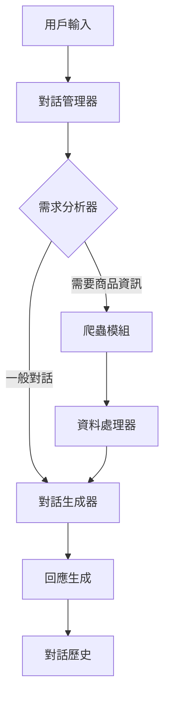

# 電商客服智能助手 (E-commerce Customer Service Agent)

這是一個基於 LangChain 和 Google Gemini 開發的智能電商客服助手系統，專為台灣電商用戶設計。系統能夠理解用戶需求，提供商品推薦，並進行即時的商品資訊爬取和比價分析。

## 🌟 主要特點

- 💬 自然語言對話：使用 Google Gemini 模型，提供流暢且自然的對話體驗
- 🔍 即時商品搜尋：自動爬取多個電商平台的商品資訊（PChome、Yahoo 購物、露天拍賣）
- 💰 智能比價功能：自動計算並比較不同平台的商品單價
- 🤝 個性化推薦：根據用戶需求提供客製化商品推薦
- 📝 對話歷史記錄：自動保存對話歷史，提供連貫的服務體驗

## 🏗️ 系統架構

### 核心組件



### 模組說明

1. **對話管理器 (Dialog Manager)**

   - 使用 LangGraph 建立對話流程圖
   - 管理對話狀態和流程轉換
   - 整合各個功能模組

2. **需求分析器 (Request Analyzer)**

   - 使用 Gemini 模型分析用戶意圖
   - 提取關鍵搜尋詞
   - 決定是否需要爬取商品資訊

3. **爬蟲模組 (Web Scraper)**

   - 支援多個電商平台（PChome、Yahoo 購物、露天拍賣）
   - 非同步爬取商品資訊
   - 處理反爬蟲機制

4. **資料處理器 (Data Processor)**

   - 商品資訊標準化
   - 價格比較和單價計算
   - 資料排序和篩選

5. **對話生成器 (Response Generator)**
   - 基於 Gemini 模型生成自然回應
   - 整合商品資訊和對話內容
   - 提供個性化推薦

## 💡 實現方式

### 1. 對話流程實現

```python
class AgentState(TypedDict):
    user_input: str
    scraped_data: List[Dict[str, Any]]
    response: str
    chat_history: List[Dict[str, str]]
    reasoning_steps: List[str]
```

- 使用 TypedDict 定義狀態類型
- 透過 LangGraph 建立狀態轉換圖
- 實現條件式路由和狀態管理

### 2. 智能分析實現

- 使用自定義 Prompt 模板進行意圖分析
- 關鍵字提取和上下文理解
- 動態調整回應策略

### 3. 爬蟲功能實現

- 使用 aiohttp 進行非同步請求
- BeautifulSoup4 解析網頁內容
- 實現重試機制和錯誤處理

### 4. 資料處理實現

- 標準化商品資訊格式
- 智能價格比較演算法
- 動態排序和篩選機制

### 5. 回應生成實現

- 使用模板化提示詞
- 整合商品資訊和對話歷史
- 生成自然且個性化的回應

## 📋 系統需求

- Python 3.8+
- Google Gemini API 金鑰
- 相關 Python 套件（見 requirements.txt）

## 🚀 安裝步驟

1. 克隆專案：

```bash
git clone https://github.com/Noname414/ecom_agent.git
cd eComAgent
```

2. 安裝依賴：

```bash
pip install -r requirements.txt
```

3. 設定環境變數：

```bash
# Linux/macOS
export GEMINI_API_KEY="您的 Google Gemini API 金鑰"

# Windows (CMD)
set GEMINI_API_KEY=您的Google Gemini API金鑰

# Windows (PowerShell)
$env:GEMINI_API_KEY="您的Google Gemini API金鑰"
```

## 💻 使用方法

1. 啟動助手：

```bash
python main.py
```

2. 開始對話：
   - 在瀏覽器中訪問 http://127.0.0.1:5000 即可使用 Web 介面與助手對話
   - 輸入您的問題或需求
   - 系統會自動分析並提供相關回應

## 🔥 功能示例

- 商品搜尋：「我想買無線滑鼠，預算 1000 元以內」
- 比價查詢：「幫我比較不同品牌的藍牙耳機」
- 一般諮詢：「有什麼推薦的電競周邊嗎？」

## 📝 對話歷史

系統會自動將對話歷史保存在 `chat_history.json` 檔案中，方便追蹤和分析使用者互動。

## ❓ 疑難排解

- **API 金鑰錯誤**：確保您已正確設定 GEMINI_API_KEY 環境變數
- **爬蟲失敗**：可能是網站結構變更或反爬蟲機制更新，請檢查網路連線或更新爬蟲模組
- **模型回應緩慢**：可能是網路延遲或 API 限制，請稍後再試

## 🤝 貢獻指南

歡迎提交 Pull Request 或開立 Issue 來協助改進專案！

## 📄 授權條款

本專案採用 MIT 授權條款 - 詳見 LICENSE 檔案

## ℹ️ 版本資訊

- 版本：1.0.0
- 最後更新：2024 年 11 月
